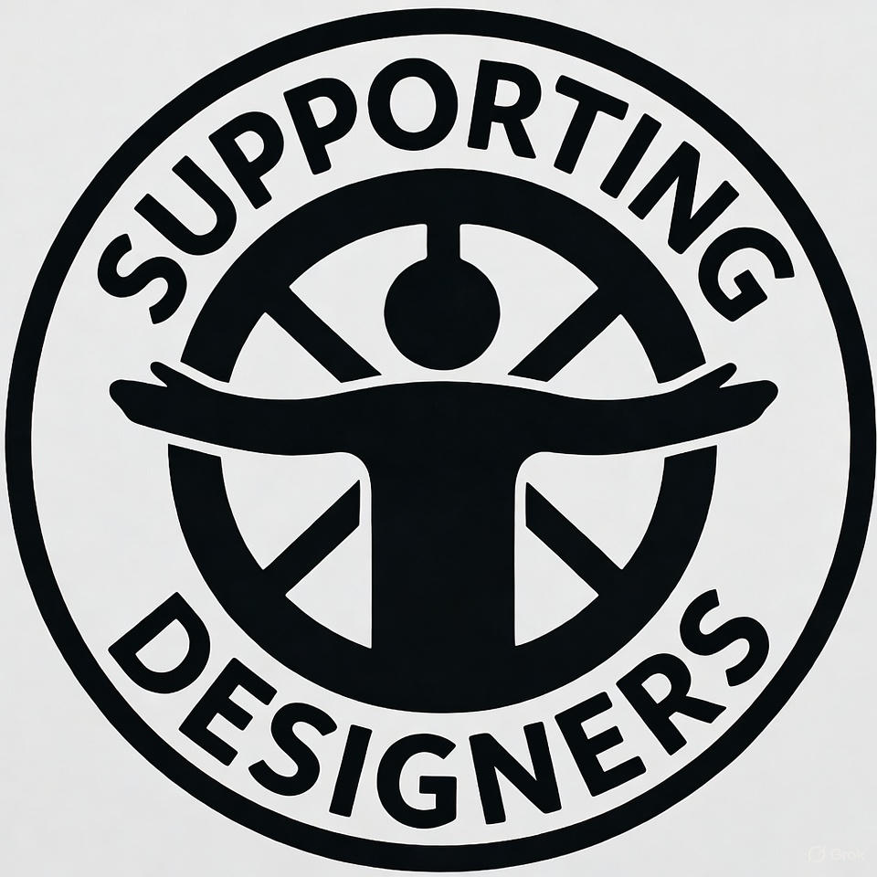

<a id="readme-top"></a>
# <h1 align="center"> Proyecto - modelo: Sistema de Gestión Academica </h1>

<div align="center">
  <a href="https://github.com/Norfalls/iujo">
    
  </a>

  <h3 align="center">Proyecto - modelo Sistema de Gestión Académica</h3>

  <p align="center">
    ¡Sistematización de proyectos, realizado por estudiantes universitarios del IUJO!.
    <br />
    <a href="https://github.com/Norfalls/iujo"><strong>Explotar documentación »</strong></a>
    <br />
    <br />
    <a href="https://github.com/othneildrew/Best-README-Template">Vista de demo</a>
    &middot;
    <a href="https://github.com/othneildrew/Best-README-Template/issues/new?labels=bug&template=bug-report---.md">Reportar Bug</a>
    &middot;
    <a href="https://github.com/othneildrew/Best-README-Template/issues/new?labels=enhancement&template=feature-request---.md">Request Feature</a>
  </p>
</div>  

### Built With/Construido con

Este proyecto se realizo a partir de los siguientes frameworks/librerias, que sirivieron para la gestión, interactividad y control de funciones del sistema.

* 
* 
* 

<p align="right">(<a href="#readme-top">Volver a la cima</a>)</p>

## ¿Quiénes somos?
<p style="text-align: justify"> En primera instancia se necesita la búsqueda de una situación que pueda corresponder con las capacidades en <strong> desarrollos de sistemas, gestión de funciones e implementación de sistemas gerenciales </strong>, dichas actividades se ajustan a las iniciativas dada por jovenes estudiantes cursantes de la carrera de <strong> INFORMÁTICA en 5to SEMESTRE </strong>, ubicados en el <strong> Instituto Técnico Universitario Jesús Obrero “IUJO”, de la calle de los Flores de Catia </strong>, en guía de su mentora metodológica Mercado Mercedes. </p>
<p style="text-align: justify;">Luego de un conjunto de propuestas organizadas y planificadas por el equipo para desarrollar un proyecto (junto a una inesperada separación de los compañeros del equipo original, reduciendo al equipo a dos integrantes), se consiguió a partir de observación y uso del <strong> Sistema Integral de Gestión Estudiantil Académica “SIGEA” </strong> del Instituto Universitario Jesús Obrero, que su interfaz de usuario presenta una experiencia de usuario poco intuitiva en varias de sus funciones.</p>
<p style="text-align: justify;">Gracias a la vinculación de objetivos en progresión e innovación por las dos partes interesadas; universidad y estudiantes, se inicia el proyecto: <strong> modelo – Sistema Gestión Académica. </strong> 
El diagnóstico de la situación muestra problemas de “responsividad” en la compatibilidad al usar el sistema en otros dispositivos que no sean ordenadores de escritorio, es común obtener estas fallas al intentar realizar acciones en celulares que corresponden a movimientos con el cursor (empleando un ratón o mouse). Estos eventos son concurrentes por el lado de los estudiantes, incluso suelen pasar desapercibidos alguna información, algún dato relevante del curso, dándose uso del propio sistema en el ordenador. </p>
<p style="text-align: justify;"> Cómo justificación el proyecto modelo - SGA, proponemos la exploración de las funcionalidades, que aparentemente son “eficientes” y cumplen con informar al usuario, pero, la forma en que se interactúa con esta misma es sosa, rebuscada, y en ocasiones casi inexistente para algunas personas, sin previa guía o indicación de otros para monitorizar una situación.
Nuestro objetivo principal es la de realizar una mejora considerable a la UI/UX (User Interfaces/User Experience) del sistema de gestión académica, innovando en la visualización de componentes para interacciones y funciones que consigan atraer a los estudiantes a explorar sus dudas y tratar situaciones ocasionales producidas por inquietudes e inconvenientes. </p>
<em style="text-align: justify;"> Este proyecto fue ejecutado por el equipo de informática, conformado por <strong> Daniel Araujo y Norkis Falcon </strong>, como parte de los requisitos de la asignatura Metodología de Investigación. </em>

### Guía de instalación de dependencias (para colaboradores)

Instalación de "dependencias" FRONTEND

```
npm install
```
## Estructura de las palabras usadas en la base de datos (para Maria y Johan)

Utilizaremos CAPITALIZAR para la mayoría de los campos.

- **En tablas**: </br>
Usaremos palabras *"plurales"* <sup>Recordad ⚠️</sup></br>
Ejm. Personas, Domicilios, PersonasDomicilios, etc.

##

- **En campos**: </br>
Usaremos palabras *"singulares"* <sup>Recordad ⚠️</sup></br>
Ejm. NroTelefonico, FechaPublicacion, etc.

**Excepciones**:

- Claves primarias: </br>
Ejm. idPersona, idSacramento, idRol

- Claves Foráneas: </br>
Ejm. id_Persona, id_Domicilios </br>
*Tablas puentes* 🌉: fk_AB_EjemploConexion </br>
**Directo de la base de datos**: `CONSTRAINT fk_UR_Rol FOREIGN KEY (id_Rol) REFERENCES Roles(idRol),`

## Propuesta

## Activades por realizar

| Colaboradores | Actividades | Tiempo Estimado |
| :--- | :---: | ---: |
| Daniel Araujo  | Frontend + Backend | 60 h |
| Norkis Falcon | Frontend + Backend | 60 h |

## Colaboradores

>- Daniel Araujo
>- C.I.: 29.896.532
>- IMasked22 
>- dasharaujo22@gmail.com

>- Norkis Falcon
>- C.I.: 26.644.945
>- Norfalls
>- example@gmail.com